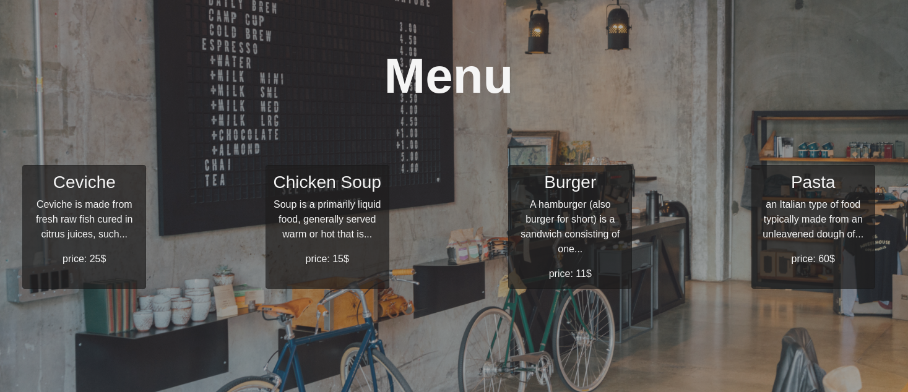

# Restaurant-App
Restaurant App built using Tabbed navigations. Tabbed navigations are very useful when you need to organize a considerable amount of side content. It's very common to use tabs in a product page, for information like delivery options, product material info etc. Another use of tabs is in dashboards, where users need a quick way to switch from one panel to the other.
# Screenshot

## Built With
- HTML & SCSS
- Bootstrap
- JavaScript/ES6
- Webpack

## Usage
1. Clone repository
2. install dependencies `$ npx run build`

## Author

👤 **Dannison Arias**

- Github: [@dannisonarias](https://github.com/dannisonarias)
- Twitter: [@AriasDannison](https://twitter.com/AriasDannison)
- Linkedin: [Dannison Arias](https://www.linkedin.com/in/dannison-arias-777919190/)

## 🤝 Contributing

Contributions, issues and feature requests are welcome!

Feel free to check the [issues page](https://github.com/dannisonarias/Javascript_Tic_Tac_Toe/issues).

## Show your support

Give a ⭐️ if you like this project!

## Acknowledgments

- Microverse
- The Odin Project

## 📝 License

This project is [MIT](./license.md) licensed.
